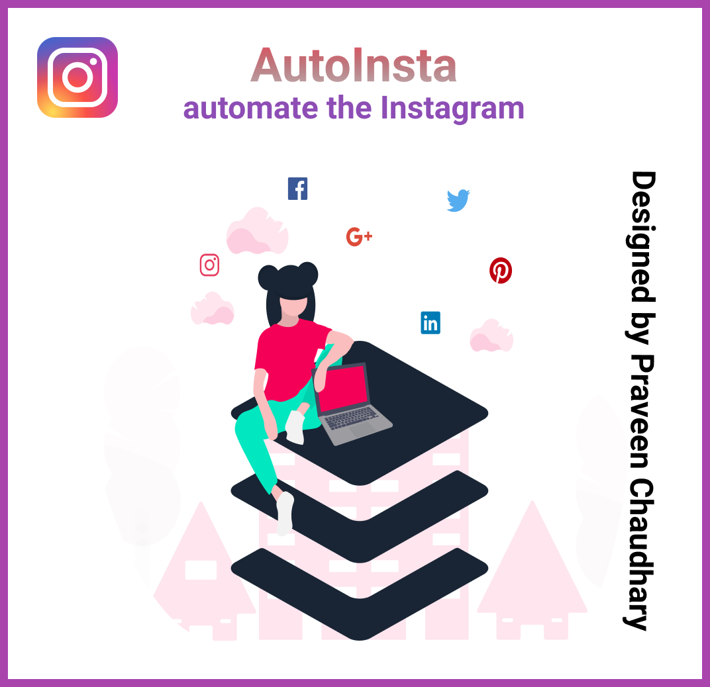

## **AutoInsta**
**This project is made with the help of Selenium drive and the Python. This project is capable of removing followers and following from your profile and it can even download the media file such as images and videos of the post.**
  
#### **How to setup :-**
1. First of all, install all the dependencies by `python3 install -r requirements.txt` in the cmd.
2. Then you need to install the selenium web driver in your system. You can follow this link :-
 <a href="https://www.youtube.com/watch?v=dz59GsdvUF8">Click me</a>
3. Now you need to change the username and password in the config.py folder or you can give it on later during the login.
4. There are three features that our project provide :-
**  A. Remove Following anyone.
  B. Remove Following that are not your follower.
  C. Download Media.**
5. First you need to login to your download. Run the program in interactive shell. If you have already made changes in the config file. Then you can login by simple command:- `login()` or If you have not entered the credentials then you can login by:- `login(username="ENTER YOUR USERNAME", password="ENTER YOUR SECRET KEY")`
7. Let's start with the **(A). Remove follower.**
 Command:-  `remove_following(remove=Enter the no of followers you want to unfollow)`
 Sample:- `remove_following(remove=6)`
8. **(B). Remove following that are not your follower.**
 **Basic syntax** :-`remove_following_not_followers(count=Enter the number of followers to remove)`
  **Sample code** :- `remove_following_not_followers(count=5)`
9. **(C). Download Media.** It can help you to download any media whether IGTV, Video Or Image.
  **Basic Syntax** :- get_media(username=USERNAME, media_type=img or video, count=3)
  **Sample** :- `get_media(username="therock", media_type=img, count=3)`
  or
  `get_media(count=3)`
 It will download all types of media file in the self logined account
 where
  **_count:_** It refers to the number of post it should search to download.
  **_username:_** Don't pass any username parameter if you want to download the self account post otherwise mention the username of other people.
  **_media_type:_** It can be anyone either img or video but you need to pass the parameter in lower case. Don't pass any parameter to download both media  type.

 
Note: 
<ol><li>The download files will be in same directory with the name of the user. The download media files function has a automatic function which will prevent the duplication of the downloaded files.</li>
<li>Don't use the opened browser as it will hinder the wortking of the code.</li>
<li>If you find that the download is not working. There might be two reason :-
<ul>
<li>Instagram might have changed the element position or element attribute</li>
<li>Your internet might be too slow</li>
<li>While downloading the media file. If the media file is video. It may take some more time depending on the internet speed.</li>
</ul></li>
</ol>
 
**All the issues and PR are most welcomed. Please make a branch before committing any changes.**
